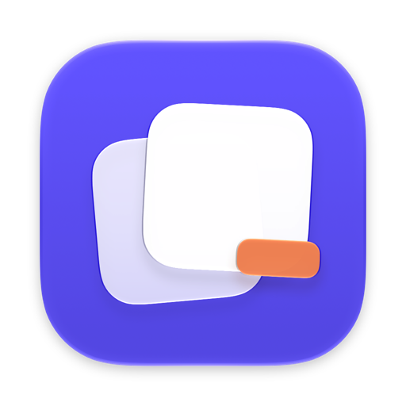
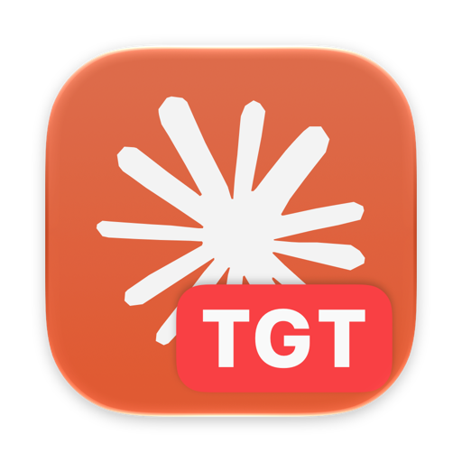
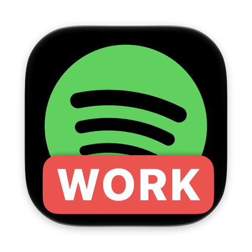

<p align="center"></p>

<h1 align="center">AppWrapper</h1>

<p align="center">A simple way to make extra copies of a Mac app, each with its own logins and settings.<br>No price tag, no subscription. A dumb app for a dumb task. Do whatever you want with it.</p>

<p align="center">
  
  &nbsp;
  
</p>

## What it does

- Makes a copy of any app in `~/Applications` that runs next to the original, with its own Dock icon. No launcher needed.
- Gives each copy its own data folder, so logins and settings stay separate.
- Lets you set environment variables per copy.
- Optionally adds a badge (`WORK`, `TGT`, …) or a custom icon, from a file or from [macosicons.com](https://macosicons.com).

## Install

Needs macOS 14+ and the Xcode Command Line Tools.

```bash
git clone https://github.com/alfremo/AppWrapper.git
cd AppWrapper
./build.sh install
```

## Use

Click **+**, pick an app, name it, click **Create**. Drag the new app to your Dock.

When the original app updates, select the copy and click **Save & Rebuild**.

## How it works

It clones the app bundle, gives it a new bundle ID, puts your environment variables (plus a separate `HOME`) in its `Info.plist`, re-signs it and registers it with macOS. The code is in [`Sources/`](Sources).

## Similar apps

A couple of paid apps on the Mac App Store do the same job:

| | AppWrapper | [Parall](https://apps.apple.com/us/app/parall/id6754065114?mt=12) | [Parallel Spaces: Clone Apps](https://apps.apple.com/us/app/id6772172563) |
|---|---|---|---|
| Price | Free | $9.99 | $4.99 |
| Source | Open (MIT) | Closed | Closed |
| Own Dock icon per copy | Yes | Yes | — |
| Separate logins and data | Yes | Yes | Yes |
| Per-copy environment variables | Yes | Launch arguments | — |
| Text badge on the icon | Yes | Yes | — |

<sub>From the US App Store listings, September 2026. "—" means the listing doesn't mention it.</sub>

## Notes

- Apps that need iCloud or other special Apple permissions may not run as copies.
- If macOS keeps asking for keychain access after rebuilds, create a code-signing certificate named `AppWrapper Local Signing` in Keychain Access (Certificate Assistant → Create a Certificate, Self Signed Root, Code Signing). AppWrapper will use it automatically.

## License

MIT
